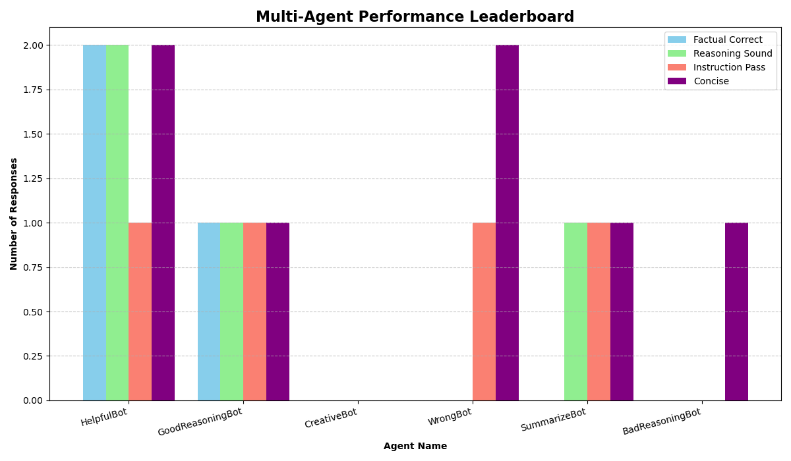

# Sophisticated Multi-Agent Evaluation Framework

This project is a complete, end-to-end framework for performing nuanced, multi-dimensional evaluations of AI agents. It has evolved beyond a single "AI Judge" into a collaborative **multi-agent system** where specialized agents work together to analyze performance across quality, safety, and efficiency.

The framework leverages tool-calling for real-world fact verification and implements a structured communication protocol to manage the evaluation workflow, making it a scalable and robust solution for truly understanding agent capabilities.


*(This multi-dimensional chart is automatically generated by the script)*

## The Problem
Manually evaluating AI agents is impossible at scale, and a simple accuracy score is dangerously insufficient. An agent's response can be:
- Factually correct, but logically flawed.
- Seemingly helpful, but fail to follow critical instructions.
- Concise and fast, but completely wrong.
- Overly verbose and expensive to generate.

To build reliable AI, we need an automated system that captures these complex trade-offs.

## The Solution: A Multi-Agent Evaluation Team
This framework decomposes the complex task of evaluation and assigns specific roles to a team of specialist AI agents, managed by a central orchestrator.

### Key Features
*   **Multi-Agent Collaboration:** A team of agents, each with a specific expertise (Fact-Checking, Logical Reasoning, Instruction Adherence, Conciseness), work in concert to provide a holistic evaluation.
*   **Tool-Augmented Fact-Checking:** The `Fact-Checker Agent` uses a live Google Search tool to verify claims against real-world, up-to-date information, moving beyond static knowledge.
*   **Multi-Dimensional Metrics:** The framework goes beyond simple scores to measure:
    *   **Quality Metrics:** Factual Accuracy, Reasoning, Instruction Following, Conciseness.
    *   **Performance Metrics:** **Latency** (in seconds) and **Estimated Cost** (in tokens) are tracked for every evaluation.
*   **Structured Communication Protocol (MCP):** The `Orchestrator` uses a formal `task_state` object to manage the flow of data, results, and metadata through the system, ensuring reliability and scalability.
*   **Automated Leaderboard & Visualization:** The script generates a final text-based leaderboard and a visual bar chart (`leaderboard.png`) for an at-a-glance comparison of agent performance across key quality axes.

## How to Run It
1.  **Prerequisites:** Python 3.7+
2.  **Install dependencies:** The new `google-search-results` library is required for the Fact-Checker's tool.
    ```bash
    pip install google-generativeai python-dotenv matplotlib google-search-results
    ```
3.  **Set up your API Keys:**
    *   Create a `.env` file in the root directory.
    *   Add your Google AI API key: `GEMINI_API_KEY="YOUR_GEMINI_KEY_HERE"`
    *   Add your SerpApi key (for Google Search): `SERPAPI_API_KEY="YOUR_SERPAPI_KEY_HERE"` (Get a free key from [serpapi.com](https://serpapi.com/))
4.  **Run the pipeline:**
    ```bash
    python evaluate.py
    ```
The script will print detailed, multi-faceted reports for each response and generate the `leaderboard.png` chart upon completion.

## Architecture Overview
The framework is managed by an **Orchestrator** that implements a multi-agent communication protocol (MCP).

### The Communication Protocol (`task_state`)
For each evaluation, the orchestrator creates a `task_state` object. This structured message is passed through the system and acts as the single source of truth for a given task, containing:
1.  **Inputs:** The original prompt and response.
2.  **Results:** A section where each specialist agent records its findings (score and justification).
3.  **Metadata:** A section where performance metrics like latency and cost are stored.

### The Agent Team
- **Orchestrator:** The "manager" who initiates the `task_state` and delegates the evaluation to the specialist agents.
- **Fact-Checker Agent:** Verifies the factual accuracy of the response by using its `google_search` tool to consult real-world information.
- **Reasoning Agent:** Assesses the logical soundness of the response, ignoring factual accuracy to focus purely on the *method*.
- **Instruction-Adherence Agent:** Checks if the response followed specific constraints from the prompt (e.g., "respond in a single sentence").
- **Conciseness Agent:** Evaluates if the response was brief and to-the-point or overly verbose.

## Project Structure
```
├── evaluate.py         # The main multi-agent evaluation pipeline script
├── data.csv            # Sample input data for the agents to be evaluated
├── requirements.txt    # Project dependencies
├── .env                # Your secret API keys (ignored by git)
├── .gitignore          # Tells git to ignore .env and other files
└── README.md           # You are here!
```